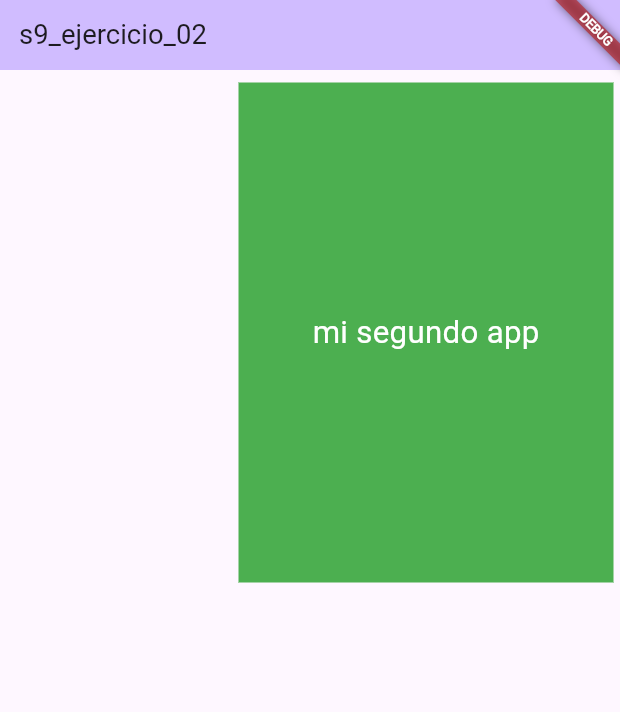

# s9_ejercicio_02

Una aplicación Flutter simple que muestra el texto "Mi segundo app" en un contenedor verde con dimensiones específicas.

## Descripción

Este proyecto es un ejercicio básico de Flutter que demuestra cómo crear una aplicación con un contenedor estilizado. La aplicación muestra la frase "Mi segundo app" dentro de un contenedor verde de 300x400, alineado a la derecha y con un margen de 10.

## Características

- Interfaz de usuario minimalista
- Contenedor verde con dimensiones específicas (300 de ancho, 400 de alto)
- Texto alineado a la derecha con tamaño de fuente de 25 y color blanco

## Requisitos previos

Antes de ejecutar este proyecto, asegúrate de tener instalado lo siguiente:

- Flutter SDK
- Dart SDK
- Un IDE compatible (como Android Studio, VS Code, o IntelliJ IDEA)

## Instalación

## Instalación

1. Clona este repositorio en tu máquina local:

   ```bash
   git clone https://github.com/german654/s9_ejercio_02.git
   ```

Navega al directorio del proyecto:
```bash
cd s9_ejercicio_01
```

Obtén las dependencias del proyecto:
```bash
flutter pub get
```

## Ejecución
Para ejecutar la aplicación en un emulador o dispositivo conectado:
```bash
flutter run
```
##  Estructura del proyecto

- lib/main.dart: El punto de entrada de la aplicación y donde se define la interfaz de usuario.

## Contribución
Este es un proyecto de ejercicio simple, pero si tienes sugerencias de mejora, no dudes en abrir un issue o enviar un pull request.
## Licencia
Este proyecto es de código abierto y está disponible bajo la Licencia MIT.

